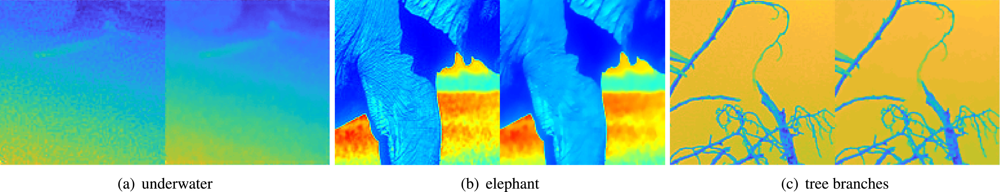

paper: <a href="https://doi.org/10.1016/j.sigpro.2019.06.020" target="_blank">Weighted Mean Curvature</a>, published in Signal Processing

***
Left is the original image and the right is our result. Our result keeps the contrast during the smoothing.


```text
@article{GONG2019,
title = "Weighted mean curvature",
journal = "Signal Processing",
volume = "164",
pages = "329 - 339",
year = "2019",
issn = "0165-1684",
doi = "https://doi.org/10.1016/j.sigpro.2019.06.020",
url = "http://www.sciencedirect.com/science/article/pii/S0165168419302282",
author = "Yuanhao Gong and Orcun Goksel",
keywords = "Mean curvature, Convolution, Neural network, Regularization, Weighted mean curvature, Curvature"
}
```
